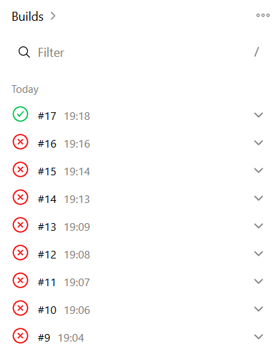

# Práctica Final ISO – Docker + CI/CD con Jenkins

## Descripción

Este proyecto consiste en una aplicación completa desplegada con Docker que incluye:

* API REST en Node.js
* Base de datos MongoDB
* Servidor Nginx para imágenes
* Orquestación con Docker Compose
* Integración continua con Jenkins

---

# Cómo levantar el entorno manualmente

## 1. Clonar el repositorio

```bash
git clone https://github.com/Ethan-Romaguera/practica-final-docker.git
cd practica-final-docker
```

## 2. Crear archivo `.env`

```bash
PORT=3000
MONGO_URI=mongodb://mongo:27017/practica_final
```

## 3. Construir y levantar contenedores

```bash
docker compose up -d --build
```

## 4. Comprobar funcionamiento

### API

```bash
curl http://localhost:3000/health
```

Respuesta esperada:

```json
{"ok":true,"status":"healthy","service":"api"}
```

### Nginx

```bash
curl http://localhost:8080
```

---

# Pipeline CI/CD (Jenkins)

La pipeline automatiza todo el proceso.

## Etapas

### 1. Checkout

Descarga el código desde GitHub.

---

### 2. Prepare env

Crea automáticamente el archivo `.env` dentro de Jenkins, ya que este archivo no se sube al repositorio.

---

### 3. Build

Construye las imágenes Docker:

```bash
docker-compose build
```

Incluye:

* API Node.js
* Nginx personalizado

---

### 4. Test

1. Limpia contenedores anteriores:

```bash
docker-compose down --remove-orphans
```

2. Levanta el entorno:

```bash
docker-compose up -d
```

3. Espera a que arranque:

```bash
sleep 10
```

4. Comprueba el estado de la API desde dentro del contenedor:

```bash
docker exec practica-api wget -qO- http://localhost:3000/health
```

---

### 5. Deploy

Despliega el entorno completo:

```bash
docker-compose up -d --build
```

---

# Decisiones tomadas y dificultades encontradas

## Decisiones técnicas

* Uso de Docker Compose para orquestar servicios
* Separación de servicios: API, MongoDB y Nginx
* Creación de imagen personalizada de Nginx en lugar de usar volúmenes
* Uso de Jenkins para automatizar build, test y deploy
* Generación dinámica del `.env` en pipeline

---

## Dificultades encontradas

### Jenkins sin Docker

Error:

```
docker: not found
```

Solución:

* Crear imagen personalizada de Jenkins con Docker instalado
* Ejecutar Jenkins como root

---

### Permisos docker.sock

Error:

```
permission denied while trying to connect to docker.sock
```

Solución:

* Ejecutar Jenkins con:

```bash
--user root
```

---

### Problema con rama

Error:

```
couldn't find remote ref master
```

Solución:

* Usar rama `main`

---

### Archivo .env no encontrado

Error:

```
.env not found
```

Solución:

* Generarlo dentro de la pipeline

---

### Conflictos de contenedores

Error:

```
container name already in use
```

Solución:

```bash
docker-compose down --remove-orphans
```

---

### Problema con volúmenes en Nginx

Error:

```
not a directory / mounting error
```

Causa:

* Jenkins está en Docker y no puede montar rutas locales

Solución:

* Crear Dockerfile propio de Nginx
* Eliminar volúmenes

---

### Problema de conexión localhost

Error:

```
curl localhost:3000 → failed
```

Causa:

* Jenkins corre en contenedor
* localhost no es la API

Solución:

```bash
docker exec practica-api wget -qO- http://localhost:3000/health
```

---

## Conclusión

Se ha implementado un entorno completo con Docker y CI/CD con Jenkins, resolviendo problemas reales de:

* Permisos en Docker
* Redes entre contenedores
* Ejecución de Jenkins en contenedor
* Diferencias entre entorno local y entorno CI

---

# AAAAAAAAAAAAAAAAAAAAAAAAAAAAAAAAAAAa, por fin coño, joder que puto asco


